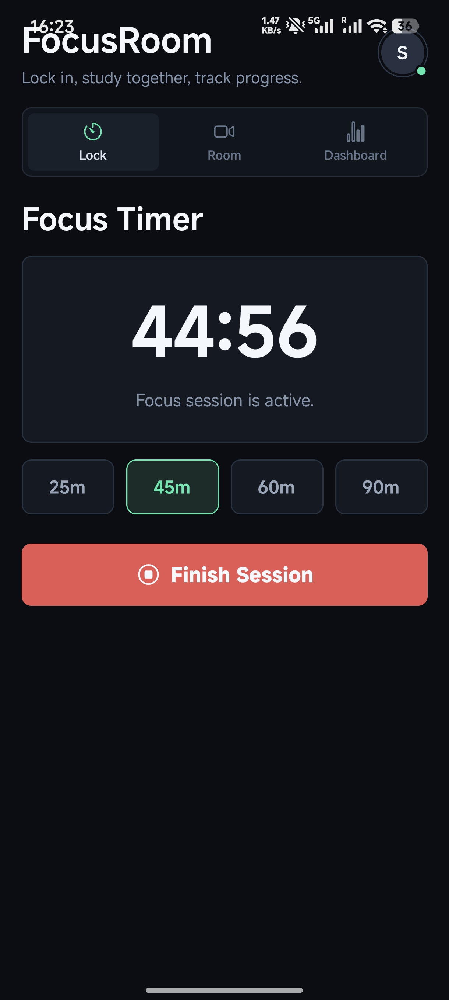
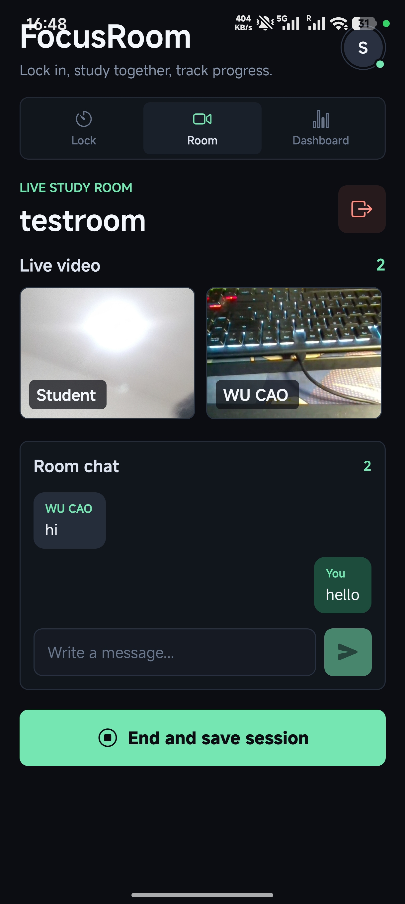
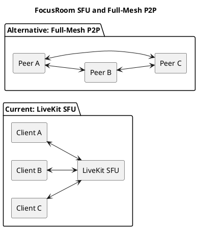

# FocusRoom

FocusRoom is a cross-platform study application built with React Native. It combines individual focus sessions with online study rooms. The same project can run on Android, iOS, and the web.

The aim is simple: users should be able to start studying quickly, stay focused, study with other people, and view their study records in one place.

## 1. Function Overview

### 1.1 User Account

Users must sign in before using the main application. FocusRoom supports Google login and anonymous guest login through Firebase Authentication. Google users can keep the same account on different devices. Guest login is useful for quick tests and demonstrations.

After login, the app loads the user's recent study sessions from Firestore. The account page displays basic profile information and provides a logout button.

### 1.2 Focus Lock



The Lock page is the main individual study function. A user can select 25, 45, 60, or 90 minutes and start a countdown. The remaining time is shown in `MM:SS` format.

The screen stays awake while this page is open. If the app leaves the foreground during a running session, the timer is reset. This rule makes the focus mode stricter and reduces phone switching during study.

When the timer ends, or when the user finishes it manually, the elapsed minutes are saved to Firestore. The dashboard is updated immediately.

### 1.3 Live Study Room



The Room page lets users study together through live video. Active rooms appear automatically through a Firestore listener. A user can enter a room name, create a new room, or join an existing one.

Camera permission is requested before entry. Inside the room, each participant has a video tile and name label. The front camera is used by default. Audio is disabled because the room is designed for quiet study.

The room also includes real-time text chat. Messages show the sender and are limited to 500 characters. The latest 100 messages are loaded. When a user selects **End and save session**, the app calculates the room time and adds it to the study history.

### 1.4 Dashboard

The Dashboard page summarizes study activity. It shows today's minutes, total minutes, session count, and progress toward a 180-minute daily goal. It also lists recent Focus Timer and Study Room sessions.

The following functions are complete in the current version:

- Google and guest login
- 25, 45, 60, and 90-minute focus modes
- Foreground monitoring and screen wake lock
- Room creation, joining, presence, and leaving
- Cross-platform live camera video
- Real-time room chat
- Cloud session storage and progress statistics

## 2. Technical Implementation

### 2.1 Technology Stack

FocusRoom uses one React Native codebase for the main interface and business flow. Platform-specific files are used only where the video SDK needs different web and native components.

| Area | Technology | Purpose |
|---|---|---|
| Application | React 19, React Native 0.81 | UI and state management |
| Toolchain | Expo 54, EAS Build | Development and native builds |
| Runtime | Hermes | Mobile JavaScript engine |
| Authentication | Firebase Authentication | Google and guest accounts |
| Database | Cloud Firestore | Sessions, rooms, presence, and chat |
| Video | LiveKit, WebRTC | Real-time camera streaming |
| Token service | Node.js, Express | Short-lived LiveKit token generation |
| Testing | Node.js test runner | Unit tests and coverage |

### 2.2 Application Structure

`App.js` controls login, tab navigation, timer state, and dashboard data. `RoomScreen.js` controls room membership and chat. Data access is separated into service modules, so UI components do not contain Firestore query details.

The video layer has two implementations. `LiveVideoRoom.web.js` uses the LiveKit React web components. `LiveVideoRoom.native.js` uses the LiveKit React Native components. Both implementations receive the same room and user data.

| Main File | Responsibility |
|---|---|
| `App.js` | Login, focus timer, navigation, dashboard |
| `RoomScreen.js` | Room workflow, presence, and chat |
| `LiveVideoRoom.web.js` | Browser video rendering |
| `LiveVideoRoom.native.js` | Android and iOS video rendering |
| `roomStore.js` | Room, participant, and message operations |
| `focusStore.js` | Session loading and saving |
| `livekitToken.js` | Client token request |
| `livekit-token-server.js` | Server-side token signing |

### 2.3 Data and Real-Time State

Firestore stores normal application data. LiveKit carries video data. This separation is important because Firestore is suitable for room state and messages, but not for high-bandwidth media streams.

The Firestore structure is:

```text
users/{userId}
  sessions/{sessionId}

studyRooms/{roomId}
  participants/{userId}
  messages/{messageId}
```

Each session stores the mode, minutes, date, and server timestamp. Each room stores its owner, active state, participant count, and creation time. Snapshot listeners update rooms, participants, and messages without manual refresh.

Room creation, joining, and leaving use Firestore transactions. This keeps the participant document and participant count consistent. If the final participant leaves, the room document is deleted.

To control reads and memory use, the app loads at most 20 rooms, 100 messages, and 30 sessions.

### 2.4 Live Video Flow

The live video function is based on WebRTC through LiveKit. The Firestore room ID is also used as the LiveKit room name. This allows web, Android, and iOS users to enter the same video session.

The connection has six main steps:

1. The user creates or joins a Firestore room.
2. The client sends the room ID and user identity to the Express token server.
3. The server creates a two-hour LiveKit JWT.
4. The client connects to the LiveKit SFU.
5. The client publishes one front-camera stream.
6. The SFU forwards the required video tracks to other users.

The client enables adaptive streaming and dynacast. These features reduce unnecessary video quality and bandwidth when a track is small or unused. Token requests can also be cancelled when the page closes, and connection errors show a retry button.

### 2.5 SFU and P2P Comparison



Full-mesh P2P was considered but not used. With `N` users, P2P needs `N(N-1)/2` connections. Each user must upload the same video `N-1` times. For four users, this means six peer connections and three uploads per user.

With an SFU, each user normally uploads one stream. The server selects and forwards streams. This reduces mobile upload traffic, CPU use, and battery use. LiveKit also handles reconnection, NAT traversal, and video quality changes.

| Item | LiveKit SFU | Full-Mesh P2P |
|---|---|---|
| Uploads per user | 1 | `N-1` |
| Four-user connections | 4 client links | 6 peer links |
| Mobile resource use | Lower | Higher |
| Multi-user scaling | Good | Poor |
| Server cost | Required | No media server |
| Implementation | SDK-managed | More custom logic |

P2P is reasonable for a one-to-one call. FocusRoom is designed for group rooms, so the SFU model is more stable and easier to maintain.

### 2.6 Security Design

Firestore rules require a Firebase identity. Users can access only their own session data. Room names are limited to 40 characters and messages to 500 characters. A participant can write only to a document matching their own user ID. Existing chat messages cannot be edited or deleted.

The LiveKit API secret is stored only on the Express server. The client receives a short-lived room token instead of the secret. The current course version does not verify a Firebase ID token at the token endpoint. A public version should add this check, HTTPS, and rate limiting.

## 3. Testing

### 3.1 Test Method

The tests were repeated on 20 June 2026 with Node.js 22.12.0. The project uses the built-in Node.js test runner, so no extra testing framework is needed.

```cmd
node --test --experimental-test-coverage test/focusMetrics.test.js test/firestoreModels.test.js
```

Two test files cover the focus calculation functions and Firestore data models. They test time formatting, invalid values, statistics, progress limits, session payloads, document mapping, default fields, room filtering, and unavailable-room errors.

### 3.2 Test Results

| Metric | Result |
|---|---:|
| Test files | 2 |
| Test cases | 18 |
| Passed | 18 |
| Failed | 0 |
| Skipped | 0 |
| Pass rate | 100% |
| Test-runner time | 156.59 ms |
| Command wall time | 261 ms |

### 3.3 Coverage

| Source File | Lines | Branches | Functions |
|---|---:|---:|---:|
| `firestoreModels.js` | 100% | 93.75% | 100% |
| `focusMetrics.js` | 100% | 82.35% | 100% |

All 18 unit tests passed. The tested business logic is stable for the current inputs. The next testing step should cover Firestore security rules, real camera devices, LiveKit network failures, and complete UI flows on Android and iOS.
